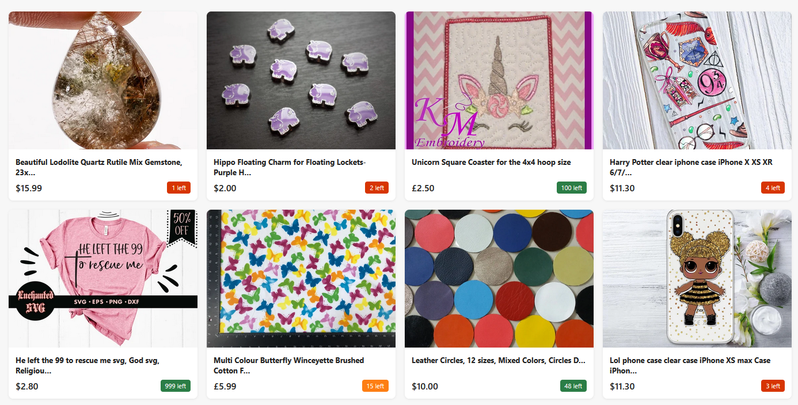

# Список предложений Etsy

[](https://github.com/DIvK-Neto/HW_12-3_react-props-listing/actions/workflows/web.yml)

[Демо "Список предложений"](https://DIvK-Neto.github.io/HW_12-3_react-props-listing/)



Реализация компонента `Listing` на React + TypeScript для отображения списка предложений Etsy. Карточки товаров включают изображение, обрезанный заголовок (до 50 символов), цену в зависимости от валюты и индикатор остатка с цветовой маркировкой.

## 📚 Документация

- [Описание задания](docs/assignment.md)
- [Функциональность](docs/features.md)
- [Установка и запуск](docs/installation.md)
- [Используемые технологии](docs/tech-stack.md)
- [Структура проекта](docs/file-structure.md)

## ✨ Особенности

- Компонент `Listing` с типизированными пропсами.
- Фильтрация удалённых товаров (`state !== 'removed'`).
- Форматирование цены: USD, EUR, GBP, другие валюты.
- Обрезка длинных названий с добавлением многоточия.
- Индикация остатка: низкий (≤10), средний (≤20), высокий (>20).

## 🚀 Быстрый старт

```bash
# Установка зависимостей
npm install
```

```bash
# Запуск в режиме разработки
npm run dev
```